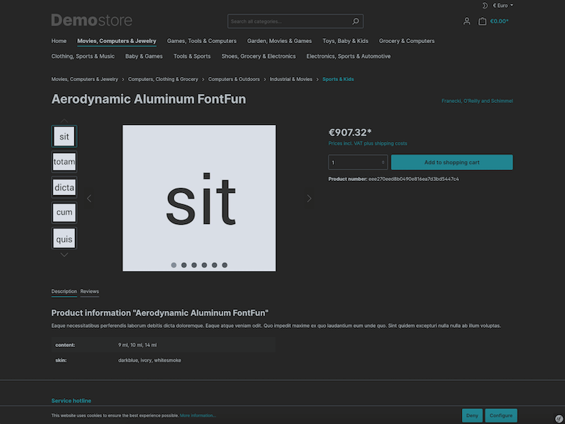
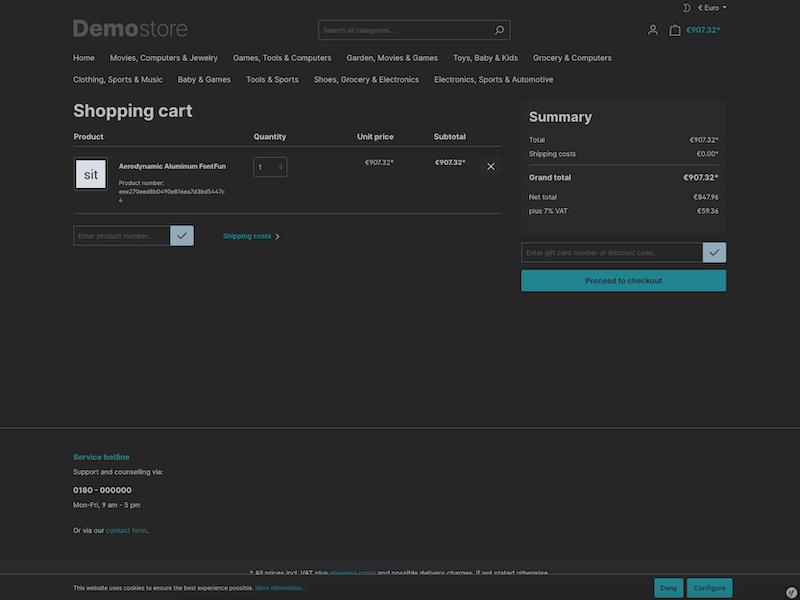
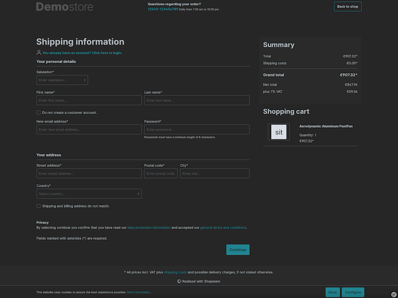

Dark Mode for Shopware 6 Storefront
=====

This plugin for [Shopware 6](https://www.shopware.de) adds a dark mode with auto-detection and/or toggle to the storefront.

The plugin offers the following features:

* Compatible with all themes
* Threshold for colors to be altered by saturation
* Set a minimum level of lightness for reduced contrast
* Tint grayscale for warmer/colder appearance
* Exclude colors from being inverted
* Auto-detect preferred color scheme
* Toggle between light and dark mode within storefront

### Using immutable colors

By declaring CSS variables using the suffix `-immutable`, color values may be stored that are supposed to be immutable, disregarding whether dark or light mode is used.

```css
:root { 
    --white-immutable: #fff; 
}

body {
    background-color: var(--white-immutable);
}
```

In this example `--white-immutable` will be `#fff` in both light and dark mode.

Requirements
-----

* 1.0.0
    * Shopware >= 6.4.18

Screenshots
-----







